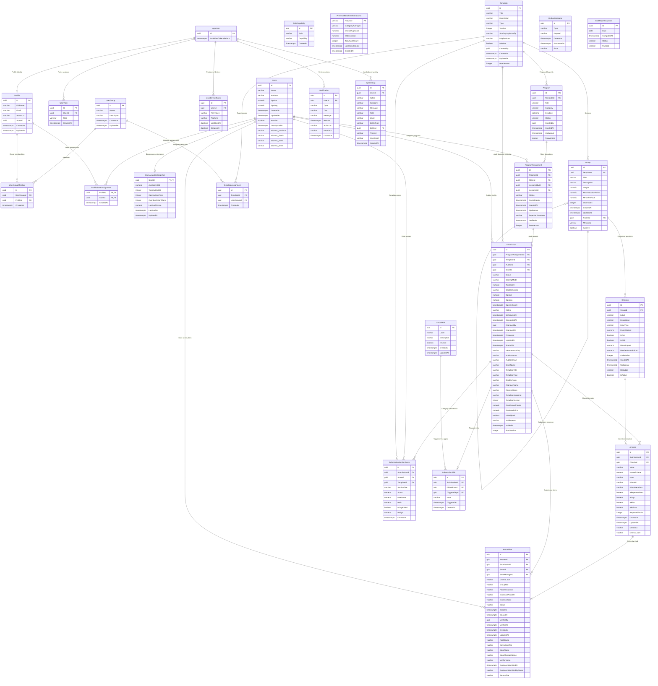

# Checkly System Entity-Relationship Diagram (Mermaid)

```mermaid
erDiagram
  AppUser {
    uuid Id PK
    timestamptz InvalidateTokensBefore
  }

  Profile {
    uuid Id PK
    varchar FullName
    varchar Email
    varchar AvatarUrl
    uuid StoreId FK
    timestamptz CreatedAt
    timestamptz UpdatedAt
  }

  UserRole {
    uuid Id PK
    uuid UserId FK
    varchar Role
    timestamptz CreatedAt
  }

  RoleCapability {
    uuid Id PK
    varchar Role
    varchar Capability
    timestamptz CreatedAt
  }

  UserGroup {
    uuid Id PK
    varchar Name
    varchar Description
    timestamptz CreatedAt
    timestamptz UpdatedAt
  }

  UserGroupMember {
    uuid Id PK
    uuid UserGroupId FK
    uuid ProfileId FK
    timestamptz CreatedAt
  }

  UserDeviceToken {
    uuid Id PK
    uuid UserId FK
    varchar FcmToken
    varchar Platform
    datetime LastUsedAt
    datetime CreatedAt
  }

  Store {
    uuid Id PK
    varchar Name
    varchar Address
    numeric GpsLat
    numeric GpsLng
    timestamptz CreatedAt
    timestamptz UpdatedAt
    boolean IsActive
    timestamptz LastSyncedAt
    varchar address_province
    varchar address_district
    varchar address_ward
    varchar address_street
  }

  ProfileStoreAssignment {
    uuid ProfileId PK, FK
    uuid StoreId PK, FK
    timestamptz CreatedAt
  }

  StoreAnalyticsSnapshot {
    uuid StoreId PK, FK
    numeric AvgScore30d
    integer TotalAudits30d
    integer OpenActionPlans
    integer OverdueActionPlans
    numeric LastAuditScore
    timestamptz LastAuditAt
    timestamptz UpdatedAt
  }

  ProvinceBenchmarkSnapshot {
    varchar Province PK
    varchar CategoryAverages
    numeric OverallAvgScore
    numeric StdDeviation
    integer TotalAuditCount
    timestamptz LastCalculatedAt
    timestamptz CreatedAt
  }

  Template {
    uuid Id PK
    varchar Title
    varchar Description
    varchar Type
    integer Version
    varchar ScoringLogicConfig
    varchar DisplayNoun
    boolean IsActive
    guid CreatedBy
    timestamptz CreatedAt
    timestamptz UpdatedAt
    integer RowVersion
  }

  Group {
    uuid Id PK
    uuid TemplateId FK
    varchar Title
    varchar Description
    numeric Weight
    numeric MaxDeductionPoints
    numeric MinusPerFault
    integer OrderIndex
    timestamptz CreatedAt
    timestamptz UpdatedAt
    guid ParentId FK
    varchar Metadata
    boolean IsActive
  }

  Criterion {
    uuid Id PK
    uuid GroupId FK
    varchar Label
    varchar Description
    varchar InputType
    numeric PointsWeight
    boolean IsCcp
    boolean IsRisk
    numeric MinusImpact
    numeric MaxDeductionPoints
    integer OrderIndex
    timestamptz CreatedAt
    timestamptz UpdatedAt
    varchar Metadata
    boolean IsActive
  }

  TemplateAssignment {
    uuid Id PK
    uuid TemplateId FK
    uuid UserGroupId FK
    timestamptz CreatedAt
  }

  Submission {
    uuid Id PK
    guid ProgramAssignmentId FK
    guid TemplateId FK
    guid AuditorId FK
    guid StoreId FK
    varchar Status
    varchar ScoringMode
    numeric TotalScore
    varchar SectionScores
    numeric GpsLat
    numeric GpsLng
    timestamptz GpsVerifiedAt
    varchar Notes
    timestamptz ScheduledAt
    timestamptz CompletedAt
    guid ApprovedBy
    timestamptz ApprovedAt
    timestamptz CreatedAt
    timestamptz UpdatedAt
    timestamptz StartedAt
    varchar IdempotencyKey
    varchar AuditorName
    varchar AuditorEmail
    varchar StoreName
    varchar TemplateTitle
    varchar TemplateType
    varchar DisplayNoun
    varchar ApproverName
    varchar ReviewStatus
    varchar TemplateSnapshot
    integer TemplateVersion
    numeric RawEarnedPoints
    numeric RawMaxPoints
    boolean IsWeighted
    varchar VoidReason
    timestamptz VoidedAt
    integer RowVersion
  }

  Answer {
    uuid Id PK
    guid SubmissionId FK
    guid CriteriaId FK
    varchar Value
    numeric NumericValue
    varchar Note
    varchar PhotoUrl
    varchar PhotoMetadata
    boolean IsRepeatedError
    boolean IsCcp
    boolean IsRisk
    boolean IsFailure
    integer RepeatedFaults
    timestamptz CreatedAt
    timestamptz UpdatedAt
    varchar Metadata
    varchar CriteriaLabel
  }

  SubmissionSectionScore {
    uuid Id PK
    uuid SubmissionId FK
    guid StoreId FK
    guid TemplateId FK
    varchar SectionTitle
    numeric Score
    numeric MaxScore
    numeric Ratio
    boolean IsCcpFailed
    numeric Weight
    timestamptz CreatedAt
  }

  ActionPlan {
    uuid Id PK
    guid AnswerId FK
    guid SubmissionId FK
    guid StoreId FK
    guid StoreManagerId FK
    varchar CriteriaLabel
    varchar GroupTitle
    varchar PlanDescription
    varchar EvidencePhotoUrl
    varchar EvidenceNote
    varchar Status
    timestamptz Deadline
    timestamptz ClosedAt
    guid VerifiedBy
    timestamptz VerifiedAt
    timestamptz CreatedAt
    timestamptz UpdatedAt
    varchar RootCause
    varchar CorrectionPlan
    varchar StoreName
    varchar StoreManagerName
    varchar VerifierName
    timestamptz EvidenceSubmittedAt
    varchar EvidenceSubmittedByName
    varchar SourceTitle
  }

  GlobalRisk {
    uuid Id PK
    varchar Label
    varchar Description
    boolean IsActive
    timestamptz CreatedAt
    timestamptz UpdatedAt
  }

  SubmissionRisk {
    uuid Id PK
    uuid SubmissionId FK
    uuid GlobalRiskId FK
    guid TriggeredById FK
    varchar Note
    timestamptz TriggeredAt
    timestamptz CreatedAt
  }

  Program {
    uuid Id PK
    uuid TemplateId FK
    varchar Title
    varchar Category
    datetime Deadline
    varchar Status
    guid CreatedBy
    timestamptz CreatedAt
    timestamptz UpdatedAt
    integer RowVersion
  }

  ProgramAssignment {
    uuid Id PK
    uuid ProgramId FK
    uuid StoreId FK
    uuid AssignedById FK
    guid AssigneeId FK
    varchar Status
    timestamptz CompletedAt
    timestamptz CreatedAt
    timestamptz UpdatedAt
    varchar RejectionComment
    timestamptz VerifiedAt
    integer RowVersion
  }

  Notification {
    uuid Id PK
    uuid UserId FK
    varchar Type
    varchar Title
    varchar Message
    timestamptz ReadAt
    varchar ActionUrl
    varchar Metadata
    timestamptz CreatedAt
  }

  SystemLog {
    uuid Id PK
    guid UserId FK
    varchar Action
    varchar Category
    varchar Message
    varchar Path
    varchar Level
    varchar EntityType
    guid EntityId FK
    varchar TraceId
    varchar UserEmail
    timestamptz CreatedAt
  }

  OutboxMessage {
    uuid Id PK
    varchar Type
    varchar Payload
    timestamptz CreatedAt
    timestamptz ProcessedAt
    varchar Error
  }

  BodReportSnapshot {
    uuid Id PK
    date Date
    timestamptz ComputedAt
    varchar Status
    varchar Payload
  }

  AppUser ||--o| Profile : "Profile Identity"
  AppUser ||--o{ UserRole : "Roles assigned"
  AppUser ||--o{ UserDeviceToken : "Registered devices"
  UserGroup ||--o{ UserGroupMember : "Members"
  Profile ||--o{ UserGroupMember : "Group memberships"
  Store ||--o{ ProfileStoreAssignment : "Manager assignments"
  Profile ||--o{ ProfileStoreAssignment : "Store assignments"
  Store ||--o| StoreAnalyticsSnapshot : "Boardroom performance"
  Template ||--o{ Group : "Sections"
  Group ||--o{ Group : "Subsection hierarchy"
  Group ||--o{ Criterion : "Evaluation questions"
  Template ||--o{ TemplateAssignment : "Target groups"
  UserGroup ||--o{ TemplateAssignment : "Assigned templates"
  Template ||--o{ Program : "Program blueprints"
  Program ||--o{ ProgramAssignment : "Store allocations"
  Store ||--o{ ProgramAssignment : "Assigned programs"
  ProgramAssignment ||--o{ Submission : "Audit records"
  Template ||--o{ Submission : "Audit blueprint snapshot"
  Store ||--o{ Submission : "Audited facility"
  Submission ||--o{ Answer : "Checklist replies"
  Criterion ||--o{ Answer : "Question snapshot"
  Submission ||--o{ SubmissionSectionScore : "Category breakdowns"
  Store ||--o{ SubmissionSectionScore : "Store scores"
  Template ||--o{ SubmissionSectionScore : "Template scores"
  Answer ||--o| ActionPlan : "Corrective task"
  Submission ||--o{ ActionPlan : "Submission plans"
  Store ||--o{ ActionPlan : "Store action plans"
  Submission ||--o{ SubmissionRisk : "Flagged risks"
  GlobalRisk ||--o{ SubmissionRisk : "Triggered risk types"
  AppUser ||--o{ Notification : "System notices"
  AppUser ||--o{ SystemLog : "Audited user activity"
```
